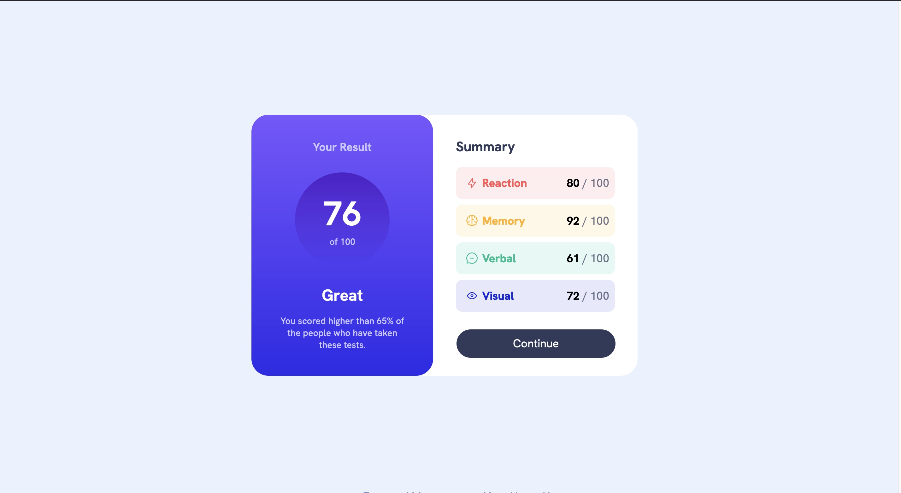

# Frontend Mentor - Results summary component solution

This is a solution to the [Results summary component challenge on Frontend Mentor](https://www.frontendmentor.io/challenges/results-summary-component-CE_K6s0maV). Frontend Mentor challenges help you improve your coding skills by building realistic projects. 

## Table of contents

- [Overview](#overview)
  - [Screenshot](#screenshot)
  - [Links](#links)
- [My process](#my-process)
  - [Built with](#built-with)
- [Author](#author)

## Overview

### Screenshot

### Links

- Solution URL: [Frontend-Mentor](https://www.frontendmentor.io/solutions/resultssummarycomponentdesktop-RcXNCgnhbY)
- Live Site URL: [GitHub Pages](https://windowpi.github.io/Results-Summary-Component/)

## My process

### Built with

- Semantic HTML5 markup
- CSS custom properties
- Flexbox

## Author

- Website - [windowpi](https://github.com/windowpi)
- Frontend Mentor - [@windowpi](https://www.frontendmentor.io/profile/windowpi)
